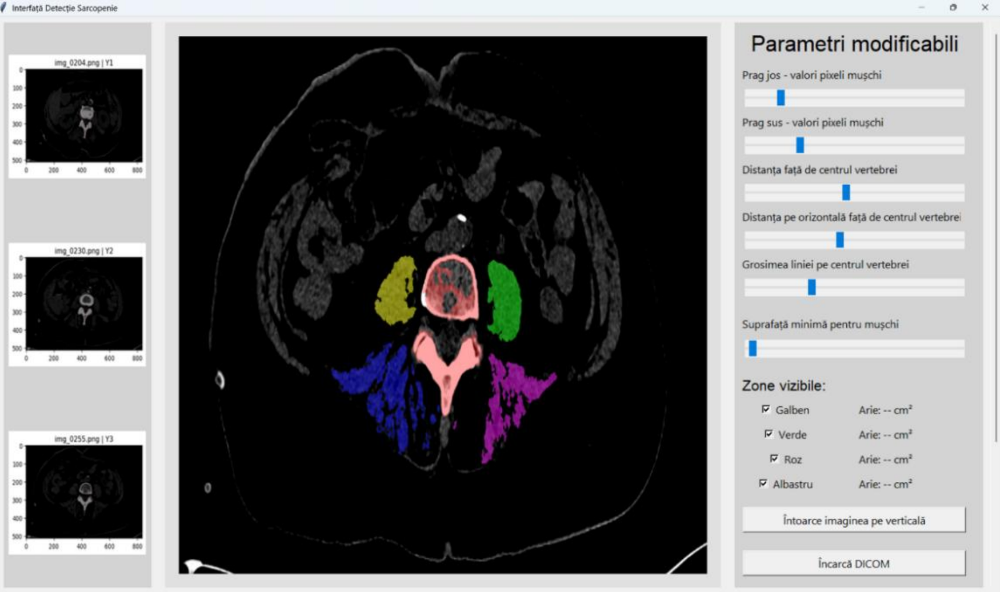

# Sarcopenia Detection Tool v1.0

> SECOND VERSION IS UNDER DEVELOPMENT!

<a href=""><strong>Documentation</strong> (under development)</a> •
<a href=""><strong>Ask a question</strong></a>

    

Made in collaboration with <a href="https://control.utcluj.ro/"><strong>Adapted Research Group</strong></a>

## About
Sarcopenia is a progressive disorder involving a significant loss of muscle mass, strength and function, primarily due to factors like aging, diet, exercise and others. 

Sarcopenia Detection Tool is a medical tool made for easing the process of giving a diagnostic to pacients that can or actually suffer from the disease sarcopenia. Is uses a **Deep Learning model that uses U-Net architecture and skeletonization** for detecting vertebers and **computer vision algorithms** to detect muscles. The GUI is made using **Tkinter**.

What is this tool for?
* It helps medical staff see a much clearer detection of the muscles without them selecting the zones
* Each muscle is segmented by it's region from the verteber resulting in a more concentred analysis
* The detection can be made on any verteber from the L1 to L3

## How to use
By pressing the `Încarcă DICOM` button, a window will open and there you have to select the folder in which is the CT scan placed.

After the processing you are able to use the widgets on the right to adjust the result.

## Further development
* A better model trained on more CT scans and that can identify the orientation of the scan, even resize or arrange the scan if needed
* A more user-friendly and autonomous GUI
* Designing a more interactive GUI
* Predicting the possible evolution of the disorder based on current and past results
